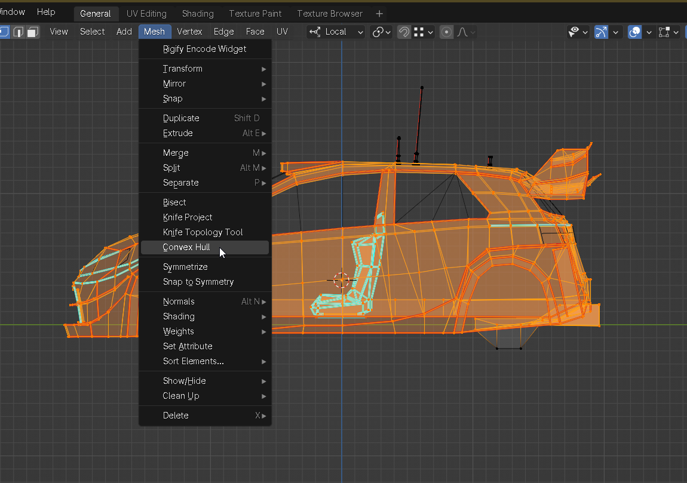
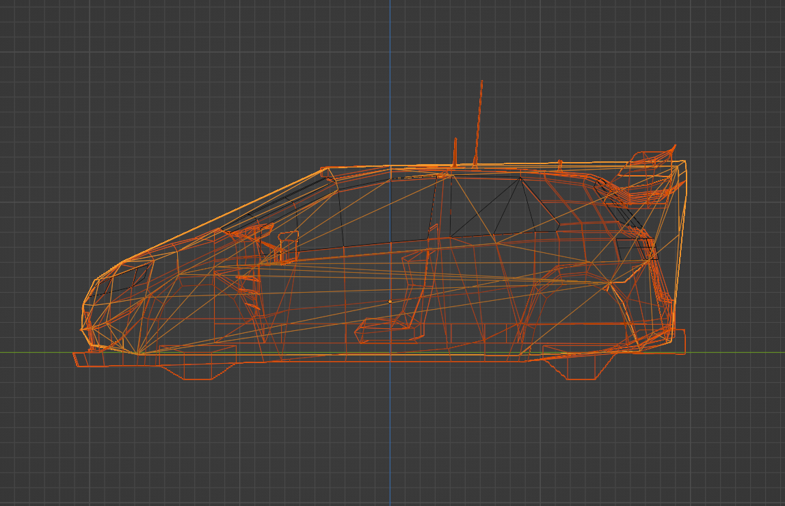

Correct as of build 2517 in paid version

# Shakedown Modding

Car and map modding is officially supported (in paid version only)!

The modding system and workflow is still work in progress, the goal being to make it as easy to use as possible (and errors as easy to understand as possible), to enable anyone to make their own mods. Because the game is still under construction, that means that the modding system is not stable. But that shouldn't discourage you from making your mods right now, because I will provide detailed modding upgrade notes for every new change as part of the [changelog](README.md#changelog).

## Modeling

The game uses glTF as its model (scene) format of choice. The reason behind using it is that it not only stores vertex data (like most other formats), but also material properties, textures, and an entire object hierarchy, hence it can act as a "scene" file. it can reuse meshes when duplicating objects, and it can export custom vertex attributes.

For the object to be valid in Shakedown Rally, it needs to have at least one material and the material needs to have a texture assigned as a color map. If a material is missing a texture, it will be rendered as magenta.

### glb vs gltf

Both are supported just fine, but understand the difference:
* glb are binary files that embed all assets (textures and vertex data) into a single file. They load faster and it's recommended to use them for release.
* gltf files are text files that reference external assets. They have 2 main benefits:
  1. Since the textures will be exported as separate files, it is possible to modify them outside of blender without the need to reexport them.
  2. They are also easier to debug as .gltf are text-based json-style files so can be opened in any text editor for inspection.

## Before you start..

..Note that while you're working on your mods you should always **LOOK AT THE CONSOLE!**

When the game starts, it loads the track and car files and any import error or warning will output both in the console and in the `log.txt` file. You can alt-tab to the console during gameplay. It's much easier to spot errors in the console because it will shine bright red. But in case of a crash check `log.txt` first (before complaining :P)

You should absolutely NOT publish car and map mods if there is any `error` outputs in the log, and I highly advise that you shouldn't publish with any `warning`s either.

## Car

(Since build 2436 in paid version):

There are 2 parts of a car, the `.car.ini` config file, which defines the parameters, and the `.gltf`/`.glb` model file.

#### Car Config

For now, only one car is loaded at a time in game. Which car loads is defined in `config.ini` -> `[car]` -> `car =` parameter. To load different cars you need to change this parameter to a certain `.car.ini` path and restart the game. (since v24) Alternatively, you can pass a `-car "path/to/car.ini"` CLI command when running the game.

The `.car.ini` file contains all the parameters for the car. It is recommended that you put it in a unique folder in `res/cars`, such as `res/cars/yourcar/yourcar.car.ini`. You can copy spec17 to get started, rename the files, and just modify parameters to your liking. Alternatively, you can edit most of the parameters live in game in the dev gui (by pressing `~`), in `Shakedown` window -> `Car Parameters` segment. After you've finished changing the values, press the `File > Save Config` in the toolbar and it will be saved into your currently loaded `.car.ini`.

#### Car Model

The `model =` parameter in the `.car.ini` points into the path of the model file (relative to the `.car.ini`), such as `model = yourcar.glb`.

The model MUST contain objects whose names end on:
* `_body` - the rendered body
* `_hull` - used for convex mesh collider (not rendered), see [Collision Hull](#collision-hull)
* a wheel object specified with `wheelObject=` in config (`_wheel` by default) - used for all wheels, a single wheel model will be copied to all sides (since build 2805)

Optionally, it can also have:
* `_headlights` - glow as headlights
* `_reverselights` - glow when in reverse
* `_brakelights` - glow as brakes

If you have any multiple objects with the same ending, the game will pick the last one. Any objects that do not have those endings will simply be hidden and not used.

You can also open `res/spec17/spec17.gltf` in blender to check out how it's set up.

Note that the wheel object must have a single material. Otherwise only the first submesh (mesh with one material slot) will render.

The pivot of body object must be exactly in the center of wheelbase and track (in the middle of all wheels). This is because the game uses just a single value for wheelBase and wheelTrack. It will place wheels at 0.5 * wheelBase back for rear wheels and same for front wheels.

The pivot of `mycar_body` is also the center of mass. So, the pivot height should be set to a realistic centre of mass height, and MUST be inside the convex mesh. If the pivot is outside the convex mesh, the car might render black as the pivot is also used for shadow raycasts and they might be hitting the body itself.

Car and wheels should be oriented in blender default reference system (Y should be pointing backwards and Z upwards) and have rotation at zero. In case rotations are not zeroed out, they must be applied (Ctrl+A -> Rotation).

##### Collision Hull

The collision mesh that the game uses for colliding the car with the world must be a convex hull mesh.

To create a convex hull in blender, copy your body model, select all vertices that you want to be part of the collision hull and click on `Mesh > Convex Hull`.



Typically, you will want to push the bottom vertices slightly higher, this will prevent the car floor from producing micro-collisions with the ground too often. I also like to recede and make the front bumper area a little bit more smooth, which prevents hard collisions when landing on jumps. Note that in real life, the bumpers are usually quite flexible, so slightly touching a protruding corner of a car shouldn't feel like it's made of solid steel. After you've made your mesh corrections, run `Mesh > Convex Hull` again to make sure the mesh is still convex.

Note the difference between the spec17 graphical model (orange) and its collision convex hull (yellow):



The collision hull must have unit scale to work correctly. Also, even if it's invisible, make sure it has a valid material to prevent "missing material/texture" errors. I typically set the body material on it.

##### Wheel Motion Blur

You can add motion blurring of the wheels through a single texture. It switches texture position according to the 
* `wheelMotionBlurSteps` defines the number of steps. That means the final, up to 8 are supported
* `wheelMotionBlurThresholds` is an array of numbers defining wheel speed threshold at which each level of blur switches to the next. Wheel speed is in radians per second.

##### Car Audio

Custom audio clips can be specified in `[car audio]` segment. Right now only one layer of engine sound is supported. Following clips can be overriden:
* `engineClip` - used for the engine sound. `enginePitchMult` defines the pitch multiplied by engine speed
* `transmissionClip` - used for gear whine. `enginePitchMult` defines the pitch multiplied by drivetrain speed
* `turboClip` - turbocharger whistle
* `gearUpshiftClip` - sound played when switching to higher gear
* `gearDownshiftClip` - sound played when switching to lower gear


## Map

(added in Build 2517)

Similar to cars, maps also consist of a `.map.ini` config and glb/gltf model files, located in `/res/maps`. Which map is loaded is defined in the `config.ini` -> `[map]` -> `map =`

The objects of a map model MUST have at least one layer of vertex color, which is used for baked ambient light (shadow + GI). The vertex color is multiplied with texture. If an object does not have this layer it will be rendered black.

Standard (non-splat) materials support only 1 texture and 1 uv layer per material.

To summarize, valid vertex data is:
- position - vec3 float
- uv - vec2 float
- color0 - vec3 unorm short or float
- color1 - vec3 unorm short or float

Any other attributes (like normals) will be discarded.

Scale of all objects that you wish to have colliders on MUST have unit scale (meaning the scale must be 1, 1, 1), otherwise collisions will not work correctly. You can apply scale in blender, by selecting objects then pressing ctrl+A -> Scale.

#### Surfaces

Note: I use the word "surface" to mean a physical surface - how the car behaves when driving over a surface, e.g. ice makes the car slide, tarmac is sealed and very grippy, snow is loose and emits white particles.. Not to be confused with "material" which is graphical property of a mesh, although materials do map to surfaces, but they're not the same thing.

There are currently 3 default surfaces: tarmac, gravel, and dirt/grass. Any object primitives (submeshes) that have materials with `tarmac` or `road` (and are not splat) in their names will use tarmac surface, any that has `gravel` will use gravel, and everything else will use dirt/grass.

Splat materials have a separate surface system that blends between surfaces using vertex colors. See [Splat Material](#Splat-Material).

Surface properties are defined in the `.map.ini` file in `[surface:SURFACENAME]` sections. Here is what each parameter means with their corresponding defaults:

```ini
[surface:soil]
gripMult = 1  # Main multiplier to the forward and sideways tire grip
steerMult = 1 # Multiplier to the steering torque, increasing will make the car more responsive
friction = 0  # Adds linear resistance (drag force) to the car, force = =velocity * friction
tireCMult= 1 # This multiplies the C parameter of the Pacejka curve, changing the curvature. Typically, loose surfaces will have smoother friction curves (less than 1)

# Audio params, will be silent by default, but you should:
tarmacAudioMult = 0 # Set to 1 for sealed surfaces (tarmac, concrete)
gravelAudioMult = 0 # Set to 1 for loose surfaces (gravel, snow)

# Graphics params:
emitParticles = 0                         # Multiplier to the chance of emitting particles, 0 - no particles emitted
kickParticlesColor = 0.358, 0.342, 0.27   # Color of the "kick" particles (small dirt particles kicked by the wheels)
trailParticlesColor = 0.537, 0.513, 0.405 # Color of the "trail" particles (the long duration dust particles coming off the back of the car)
trailParticlesLifetime = 5                # How long the trails will last, in seconds
```

#### Object and Material Tags

There are some special tags you can insert into your object names to assign certain behavior to them (they are case sensitive):
- `colbox` will create a box collider with the size of the object's bounding box
- `nocol` will become render-only, no collision objects. Meaning you can drive through these objects.
- objects starting with `chk_` and ending in `.001`, `.002`, `.003` etc. are checkpoints (splits). They must be in order with no interruptions. They will use a box collider (as if they had a `colbox` tag), so to be valid they should not be 0-thin in either dimension. The finish line is the last checkpoint.
- `mvbl` (or starting with `stage_sign`) will make the object into a "moveable" - rigid bodies the player can topple. Right now only a bounding box collider is supported, and will be automatically added no matter if you have a `colbox` tag or not
  - `m=NUMBER` can be added to the same object, where `NUMBER` is weight in kg. For example `bollard_mvbl_m=100` will make a 100 kg bollard. (note: parsing[^1])
- `strt` defines the starting location. (notes: override[^2], placement[^3]). If there are multiple `strt` objects, the last one will be used.
- `sundir` defines the object that will be used for pointing the sun towards its -Z axis (opposite from blue arrow blender gizmo) that car uses for shadowing itself. If none is found, the game will point the sun top-down.
- `splatsrc:` see [Splat Material](#Splat-Material).

If none of these tags are found, an object will be static and will have a mesh collider.

There is a few material tags as well:
- `colproxy` material will be collision only but will not render. This is useful when for example you have an object made with geometry nodes in blender and you want it to have a collider that is different than the graphical object.
- `nocol`, same as object tags ^
- `sft` makes the object's collider "soft": it will have a collider that can be partially penetrated with a weaker response spring force than normal. Used for example for soft snow cover.
- `splat:` see [Splat Material](#Splat-Material).

### Splat Material

(Requires Blender 4.0+)

A special splat shader which uses the second vertex color layer can be used for [splatting](https://en.wikipedia.org/wiki/Texture_splatting), i.e. blending between 4 different surfaces (and textures). Materials that use splat must contain the `splat:SPLATNAME` tag where `SPLATNAME` is your custom identifier.


<sup>Object with a splat:sweden splat material and its vertex color</sup>

(since v22) The splat vertex color layer must be named "_SPLAT" and exported with the "Data > Mesh > Attributes" option in the Blender's gltf exporter.

Since Blender's gltf exporter cannot out-of-the-box export references to 4 textures in a single material, a proxy object that will "tell" the game which textures to use for which channel for a particular splat material must exist. This source object needs to be named in the form of `splatsrc:SPLATNAME`, where `SPLATNAME` is the same identifier you used in the splat material.


<sup>The corresponding splatsrc:sweden object with 4 materials for each channel</sup>

The splat source object now should have up to 4 materials with textures assigned to the albedo. Each of these materials must contain channel tags:
- `ch:0` is the base, or pure black vertex color will render this texture,
- `ch:r` added by the red vertex color,
- `ch:g` added to green vertex color, and
- `ch:b` added to blue vertex color.

Each of the added textures (R, G & B) provided must also have an alpha. The alpha is used as a mask for blending textures. It is VERY IMPORTANT to connect the alpha output of the texture in the shader to alpha of the BSDF, otherwise gltf won't export the alpha channel and you won't see any blending.

Using a `SPLATNAME` (custom identifier) allows you to have multiple different splat materials, for example one for the road, one for terrain.

Surfaces for splat materials are blended by vertex color. All properties are linearily interpolated. 

Splat surface properties must be defined in the `.map.ini` file, otherwise the game will crash (with an error message. Which physical surface is used for which splat layer must be defined in the `.map.ini` in the `[splat:SPLATNAME]` section like:

```ini
[splat:kenya_road]
0 = soil
r = mud
g = grass
b = soil
```

The names of surfaces must have corresponding `[surface:SURFACENAME]` section, see .

You can also map one surface to multiple splat layers if you wish to reuse them.

You can also edit any of the properties live in game, in the dev GUI by pressing `~`, find `Drive > Surfaces > Map-based editable`. After you've done editing them, hit `Save to map.ini` at the bottom of the section.

#### Tips
* Prefer using box colldiers for small objects that don't need precise collision. In Monty stage those are for example chairs and tables in the town, as mesh colliders would be too dense and unnecessarily slow down the game.
* Exporting .png images with alpha in Photoshop will by default treat alpha as transparency. To export alpha properly as a separate channel without ruining RGB channels, use the [SuperPNG extension](http://www.fnordware.com/superpng/). My personal preference for textures is png, but format itself ultimately doesn't matter if you export gltf/glb with jpeg setting on.
* Note that gltf/glb recognizes mesh instances, if multiple objects use the same mesh, it will reuse it. It can greatly reduce the size of the track and loading times especially if there are many reused objects, like trees. Although the problem with instancing is that it will not have unique vertex color baked lighting applied. To instance objects in blender (reuse the same mesh) use alt + D when copying instead of ctrl + D.

[^1]: Note that number ends with a first non-number character, which also includes `.`. So if the number is at the end of the objects name, copying the object in blender makes it a `mvbl_m=100.001`, meaning the mass will be `100.001`, so prefer not putting the tag at the end of the name.
[^2]: You can also override the starting position without changing the map model in config by setting `overrideStartingPosition = 1` and providing position and rotation. But the override is mostly used for testing and it is recommended to use the model-embedded `strt` object instead.
[^3]: You should put the `strt` object a little above the track because the car is centered around its center of mass. Putting the `strt` object too high will however make it "drop" at start.