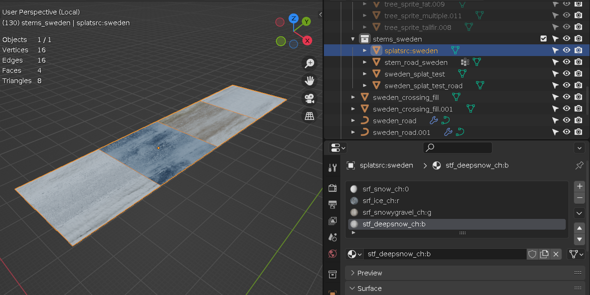

Correct as of build 879

# Shakedown Modding

My goal for the game is to make modding as easy as possible, BUT it is not yet officially mod "friendly". It doesn't even have track or car picking, nor good error messages if you do something wrong. Nothing stops you from changing the car parameters or asset files right now as they're "out in the open" but as I am still changing everything I advise you to wait a bit as I will make your life easier.

## Modeling

The game loads gltf/glb files with embedded textures. Only gltf exporter in blender version 3.3 is supported. There seems to be an issue with newer versions of blender, the vertex colors are messed up.

For the object to be valid, it needs to have a material and the material needs to have a texture assigned as a color map.

### glb vs gltf

Both are supported just fine, but:
* Glb files are binary files, they are smaller and load faster, it's recommended to use them for release.
* gltf are easier to debug as they are text-based json-style files so can be opened in any text editor for inspection.

## Car

Right now, only one car is loaded and hardcoded to `spec17.gltf`, open it to see  the objects within. Custom objects must retain the same names as they are loaded by name:

* `spec17_body` - the rendered body
* `spec17_hull` - used for convex mesh collider
* `spec17_wheel` - used for all wheels
* `spec17_reverselights`, `spec17_brakelights` - glow as brakes/reverse lights

All of these objects must have a single material each. Otherwise the game will just pick one submesh (mesh with one material slot) and keep the others in the middle of track.

The pivot of body object must be exactly in the center of wheelbase and track (in the middle of all wheels). This is because the game uses just a single value for wheelBase and wheelTrack. It will place wheels at 0.5 * wheelBase back for rear wheels and same for front wheels.

Another thing is that the pivot should be inside the convex mesh

## Stage

Object MUST have at least one layer of vertex color, which is used for baked ambient light (shadow + GI). The vertex color is multiplied with texture. If an object does not have this layer it will be rendered black.

Standard (non-splat) materials support only 1 texture per and 1 uv layer per material.

To summarize, valid vertex data is:
- position - vec3 float
- uv - vec2 float
- color0 - vec3 unorm short or float
- color1 - vec3 unorm short or float

Any other attributes (like normals) will be discarded.

Scale of all objects that you wish to have colliders on MUST have unit scale (meaning the scale must be 1, 1, 1), otherwise collisions will not work correctly. You can apply scale in blender, by selecting objects then pressing ctrl+A -> Scale.

#### Surfaces

Note: I use the word "surface" to mean a physical surface - how a surface influences the car and game, e.g. ice makes the car slide, tarmac is sealed and very grippy, snow is loose and emits white particles.. Not to be confused with "material" which is graphical property of a mesh, although materials do map to surfaces, but they're not the same thing.

There are currently 2 default-material physical surfaces: tarmac and dirt. Any object primitives (submeshes) that have materials with `tarmac` or `road` (and are not splat) in their names will use tarmac surface, and everything else will use dirt.

Splat materials have a separate surface system that blends between surfaces using vertex colors. See [Splat Material](#Splat-Material).

#### Object tags

There are some special tags you can put in your object names (they are case sensitive):
- `colbox` will create a box collider with the size of the object's bounding box
- `nocol` or `tree` will not make a collider
- objects starting with `chk_` and ending in `.001`, `.002`, `.003` etc. are checkpoints (splits). They must be in order with no interruptions. They will use a box collider (as if they had a `colbox` tag), so to be valid they should not be 0-thin in either dimension. The finish line is the last checkpoint.

If none of these tags are found, an object will be static and will have a mesh collider.

#### Special objects
- `suncube` is used for pointing the sun towards its -Z axis (opposite from blue arrow blender gizmo) that car uses for shadowing itself. If none is found, the game will point the sun top-down.

#### Tips
* LOOK AT THE CONSOLE! When the game starts, it loads the track and car files. Any import error will output both in the console and in the `log.txt` file. You can alt-tab to the console during gameplay. It's much easier to spot errors in the console because it will shine bright red. But in case of a crash check `log.txt` first (before complaining :P)
* Prefer using box colldiers for small objects that don't need precise collision. In Monty stage those are for example chairs and tables in the town, as mesh colliders would be too dense and unnecessarily slow down the game.
* Exporting .png images with alpha in Photoshop will by default treat alpha as transparency. To export alpha properly as a separate channel without ruining RGB channels, use the [SuperPNG extension](http://www.fnordware.com/superpng/). My personal preference for textures is png, but format itself ultimately doesn't matter if you export gltf/glb with jpeg setting on.

### Splat Material

A special splat shader which uses the second vertex color layer can be used for [splatting](https://en.wikipedia.org/wiki/Texture_splatting), i.e. blending between 4 different textures. Materials that use splat must contain the `splat:SPLATNAME` tag where `SPLATNAME` is your custom identifier.

Since Blender's gltf exporter cannot out-of-the-box export references to 4 textures in a single material, there needs to exist a proxy object that will "tell" the game which textures to use for which channel for a particular splat material. This source object needs to be named in the form of `splatsrc:SPLATNAME`, where `SPLATNAME` is the same identifier you used in the splat material.

)

The splat source object now should have up to 4 materials with textures assigned to the albedo. Each of these materials must contain channel tags:
- `ch:0` is the base, or pure black vertex color will render this texture,
- `ch:r` added by the red vertex color,
- `ch:g` added to green vertex color, and
- `ch:b` added to blue vertex color.

Each of the added textures (R, G & B) provided must also have an alpha. The alpha is used as a heightmap. It is VERY IMPORTANT to connect the alpha output of the texture in the shader to alpha of the BSDF, otherwise gltf won't export the alpha channel and you won't see any blending.

Using a `SPLATNAME` (custom identifier) allows you to have multiple different splat materials, for example one for the road, one for terrain.

Surfaces for splat materials are blended by vertex color. All properties are linearily interpolated. Right now the surface properties are hardcorded.